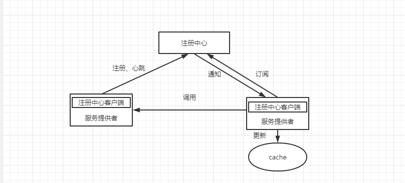

常用的注册中心，对比其流程和原理

## 什么是注册中心

### 注册中心三种角色 

服务注册中心【registry】：用于保存rpc server的信息，rpc server节点发生变更 会同步到registry，rpc client感												知后刷新本地缓存的服务节点列表

服务提供者【rpc sever】：启动时，向registry注册自身服务，并定时向其发送心跳汇报存活情况

服务消费者【rpc  client】：启动时，向registry订阅服务，把registry返回的服务节点列表缓存在本地，并与服务												提供者建立连接

### 注册中心需要实现的功能

### 注册中心相关理论

#### CAP

一致性**Consistency**、可用性**Availability**、分区容错**Partition tolerance**

#### 分布式一致性协议

paxos、 raft、 zab

##### paxos

基于消息传递的一致性算法

##### raft

raft是paxos的简化版，强调易理解、易实现，raft和paxos一样只要保证半数节点正常就能保证正常提供服务

##### zab

zookeeper原子消息广播协议，是zookeeper实现分布式一致性的核心算法

zab借鉴paxos针对zookeeper定制，paxos是通用

## 常用注册中心

实践中，注册中心不能以因为自身任何原因破坏服务之间的可连通性，**可用性高于一致性**

### zookeeper

### eureka

### nacos

## 注册中心选型

#### 关于CP 还是AP的选择 

选AP注册中心可用性高于一致性，所以更倾向于eureka、nacos；关于这两者之间选哪个，谁让我做的事更少就选哪个，显然nacos帮我做的事更多。同时eureka2.0之后的不再开源，nacos

https://mp.weixin.qq.com/s/Mg3LLVdVtKqOQLIxrOvVLw

https://mp.weixin.qq.com/s/uOuaBoUH9SJ5hY81S0eXkw