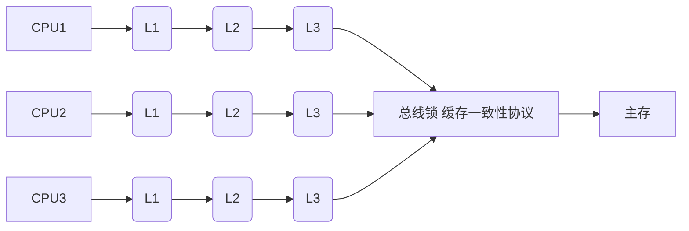

**volatile保证可见性、有序性 不保证原子性**

lock add指令

**相关书籍**

https://docs.oracle.com/javase/specs/

The Java Language Specification

The Java Virtual Machine Specification

### 指令重排序

#### 概念

操作系统在执行一组指令时，为了优化执行效率，会将一些不互相影响的指令交换执行顺序 ，前提是这些指令的执行结果不互相影响

#### 举例

**对象的创建过程**

Test test = new Test();

**java字节码指令**

jclasslib

```java
0 new #2 <com/wdq/Test>                     //申请堆内存，初始化成员变量
3 dup
4 invokespecial #3 <com/wdq/Test.<init>>    //构造方法，成员赋值
7 astore_1									//栈贞中的test与堆中的Test()实例建立关联，指针指向堆
8 return
```


操作系统在执行对象创建的字节吗指令时，先在堆内存中分配了空间成员为初始值，之后操作系统发生了指令重排序，astore_1先于invokespecial执行test已经与new Test()建立了联系，此时对象test处于半初始化状态


#### 如何防止指令重排序


JVM规范规定，被volatile修饰的内存空间禁止对其进行指令重排序，JVM虚拟机（hotspot/j9）的实现方式是在这块内存加上内存屏障。

被volatile修饰的变量（内存）在JVM生成汇编指令时加上一条**lock addl 0x0**指令作用仅仅是将RSP寄存器中加0，这条指令是空操作但是它是被锁住的，lock指令实现（充当）内存屏障的作用。


```java
内存地址						0X0 十六进制的0
0x0000000002e1e22a: lock addl $0x0,(%rsp)     ;*putstatic i
                                                ; - com.wdq.T::n@1 (line 14)
```


#### lock指令

**多处理器环境下，lock指令保证某个处理器对共享内存的独占使用。**

**作用是将当前处理器的缓存刷新到主内存，并使其它缓存对应的主内存失效，另外还提供了有序的指令无法越过这个屏障的作用。**


synchronized之所以能保证可见性，是因为synchronized的底层cpu指令也是lock(lock cmpxchg)，所以能保证可见性。

```java
  0x0000000003292a5e: lock cmpxchg %rbx,(%rsi)
```


LOCK指令前缀只能作用于一下指令

BT, BTS, BTR, BTC   (mem, reg/imm)
**XCHG**, XADD  (reg, mem / mem, reg)
**ADD**, OR, ADC, SBB   (mem, reg/imm)
AND, SUB, XOR   (mem, reg/imm)
NOT, NEG, INC, DEC  (mem)

**lock cmpxchg、lock addl都包含其中**


### volatile作用

#### 保证有序性

**volatile能禁止程序重排序，保证程序严格按照语句顺序执行，保证程序的有序性**

##### volatile禁止重排序规则

1. 当第二个操作是volatile写时，不管第一个操作是什么，都不能重排序。这个规则确保volatile写之前的操作不会被	编译器重排序到volatile写之后。
2. 当第一个操作是volatile读时，不管第二个操作是什么，都不能重排序。这个规则确保volatile读之后的操作不会被	编译器重排序到volatile读之前。
3. 当第一个操作是volatile写，第二个操作是volatile读时，不能重排序。

##### 举例

```java
boolean inited = false;// 初始化完成标志
//线程1:初始化完成，设置inited=true
new Thread() {
    public void run() {
        context = loadContext();   //语句1
        inited = true;             //语句2
    };
}.start();
//线程2:每隔1s检查是否完成初始化，初始化完成之后执行doSomething方法
new Thread() {
    public void run() {
        while(!inited){
          Thread.sleep(1000);
        }
        doSomething(context);
    };
}.start();
```

###### 目标

线程1初始化完成，设置inited=true，线程2轮询检查是否初始化完成，初始化完成inited=true后执行doSomething方法

###### 问题

编译器可能对语句1、语句2进行指令重排序，导致语句2在1之前执行这时context没有加载完成，这时线程2读取到inited = true调用doSomething方法但context还没加载完成导致出现问题

###### 解决

使用volatile修饰inited变量，禁止编译器、处理器对语句1/2重排序

volatile写操作内存屏障指令伪代码

```java
volatile boolean inited = false; 

context = loadContext();   //语句1

StoreStoreBarriers;（context写操作对其它处理器可见（刷新到内存）先于inited写操作）
inited = true;             //语句2
StoreLoadBarriers;（inited写操作对其它处理器可见（刷新到内存）先于对inited的读操作）

```


#### 保证可见性

**volatile保证了程序的可见性**

volitaile修饰的变量，汇编指令上会加上lock指令，CPU在对这块内存进行操作时将CPU与主内存通信总线上加锁 或者 对此缓存行加锁，通过串行化 或者 缓存一致性协议保证这块内存区域对其它CPU缓存可见


##### volatile可见性规则

对一个volatile变量的读，（其它Cpu的线程）总是能读到对这个volatile变量最后的写。

1. 一个线程修改volatile变量的值，**该变量即刷从缓冲区立新到主内存中**，这个新值对其它线程来说是立即可见的

2. 一个线程读取volatile变量的值，**该变量在CPU缓存中是无效的，需要到主内存中读取**。

   

##### 缓存一致性问题

两个线程同时读取同一内存中的数据放在各自CPU的高速缓存， 计算完成后，两个线程将计算结果同步到主内存中， 最终会导致一个cpu的计算结果丢失，这就是***缓存一致性问题***。

为了解决缓存不一致性问题，通常来说有以下 2 种解决方法：

- 通过总线加锁
- 通过缓存一致性协议


###### 总线锁

最早的CPU都是通过总线锁来解决缓存不一致问题，因为**CPU与其他硬件通信都是通过总线来进行的**，在总线上加锁就阻断了其它CPU对硬件的访问包括主内存，只有当前线程将CPU计算结果同步到主内存并释放总线锁之后其它线程才能访问主内存，就解决了缓存不一致问题。但是总线上加锁，**锁住总线期间其它CPU都无法访问主内存导致效率低下**，所以就有了缓存一致性协议

###### 缓存一致性协议





##### 举例

```java
public class Test {
public int a = 0;

public void increase() {
		a++;
	}

public static void main(String[] args) {
final Test test = new Test();
for (int i = 0; i < 10; i++) {
new Thread() {
public void run() {
for (int j = 0; j < 1000; j++)
						test.increase();
				};
			}.start();
		}
while (Thread.activeCount() > 1) {
// 保证前面的线程都执行完
			Thread.yield();
		}
		System.out.println(test.a);
	}
}
```

###### 目标

启动十个线程，每个线程a+1000，理想结果是10000

###### 问题

实际结果小于10000

忽略a++原子性，假设两个CPU的线程A、B，线程A读取a=0，进行a=a+1操作但还未刷新到内存，此时线程B读取内存中a=0，进行a=a+1，然后线程A、B依次刷新内存a=1，而不是期望的a=2。这就是可见性问题

###### 解决

volatile修饰变量a

a发生写之后CPU将缓冲区中的数据立即刷新到内存中，并通知其他处理器指向同一块内存地址的CPU缓存中的数据失效。


#### 不保证原子性


### volatile实现原理

#### 保证有序性原理

**java编译器在生成字节码时，在volatile变量前后的指令序列中插入内存屏障来禁止特定类型的重排序。**

###### volatile内存屏障插入策略

1. 在每个volatile写操作前面，插入一个StoreStore屏障
2. 在每个volatile写操作后面，插入一个StoreLoad屏障
3. 在每个volatile读操作前面，插入一个LoadLoad屏障
4. 在每个volatile读操作后面，插入一个LoadStore屏障

| 类型       | 示列                         | 说明                                                         |
| ---------- | :--------------------------- | ------------------------------------------------------------ |
| LoadLoad   | Load1,LoadLoad屏障,Load2     | 确保Load1数据的装载，先于Load2及其后续数据装载               |
| StoreStore | Store1,StoreStore屏障,Store2 | 确保Store1数据对其它处理器可见（刷新到内存），先于Store2及其后续存储指令执行 |
| LoadStore  | Load1,LoadStore屏障,Store2   | 确保Load1数据装载，之前于Store2及其后续的存储指令刷新到内存  |
| StoreLoad  | Store1,StoreLoad屏障,Load2   | 确保Store1数据对其它处理器可见（刷新到内存），之前于Load2及其后续装载指令执行 |


#### 保证可见性原理

根据volatile内存屏障插入策略，在每个volatile写操作后面，插入一个StoreLoadBarriers，确保在后续所有读操作之前数据对其它处理器可见

StoreLoad屏障会生成一个Lock前缀的指令（JMM向操作系统发送），Lock前缀的指令在多核处理器下会引发了两件事：

1. 将当前处理器缓冲区的数据写到系统内存
2. 这个写到系统内存的操作会使在其它CPU缓存了该内存地址的数据无效


[**观察加入 volatile 关键字和没有加入 volatile 关键字时所生成的汇编代码发现，加入 volatile 关键字时，会多出一个 lock 前缀指令**](http://mp.weixin.qq.com/s?__biz=MzI2MTIzMzY3Mw==&mid=2247490853&idx=2&sn=d8c3d64c7ee4504206d75eb20540ccab&chksm=ea5cd043dd2b5955cfc3f96f52e52653a7781ce2841d2061db60c53dfeedaa8a53f5a4fbc60c&scene=21#wechat_redirect)

lock 前缀指令实际上相当于一个内存屏障（也称内存栅栏），内存屏障会提供 3 个功能：

- 它确保指令重排序时不会把其后面的指令排到内存屏障之前的位置，也不会把前面的指令排到内存屏障的后面；即在执行到内存屏障这句指令时，在它前面的操作已经全部完成；
- 它会强制将对缓存的修改操作立即写入主存；
- 如果是写操作，它会导致其他 CPU 中对应的缓存行无效。


#### volatile内存可见的写-读过程

1. volatile修饰的变量写操作
2. 编译器在该写操作后面插入一条StoreLoad内存屏障，JMM根据该内存屏障向操作系统发送一条Lock前缀的操作系统指令
3. Lock前缀的操作系统指令让写操作对其它CPU可见（刷新到系统内存），并且使其它处理器缓存的该变量数据（缓存的同一内存地址的数据）失效
4. 其它CPU读取volatile修饰的变量时发现失效，就会读取到系统内存中最新的数据

### 总结

volatile修饰的变量对其进行修改，保证对其它线程可见

volatile修饰的变量保证有序性，不保证原子性

volatile是通过插入内存屏障禁止重排序来保证可见性和有序性的。

