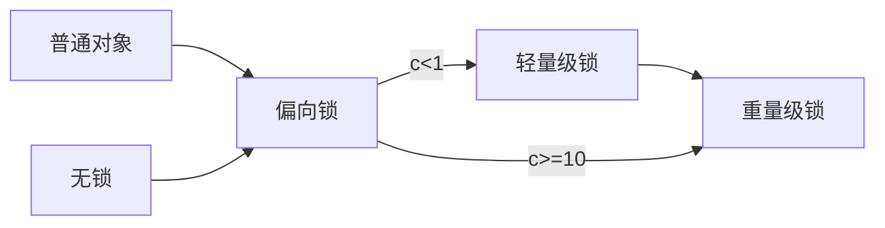

### 锁分类


#### 根据修饰方式分类

##### 修饰代码块

**monitor**加锁，monitorenter锁入口monitorexit 锁出口，两个配合使用，java 生成的汇编指令文件中有两monitorexit ，前一个是正常锁出口后一个monitorexit   异常锁出口

java中每个对象都有一个monitor对象，对象锁通过monitor对象实现加锁 monitor，一个类存在多个对象，每个对象的锁互不干扰。

**monitorenter 锁入口**

**monitorexit   正常锁出口**

**monitorexit   异常锁出口**


##### 修饰方法

ACC_SYNCHRONIZED


synchronized修饰方法时，ACC_SYNCHRONIZED作为锁标记


#### 根据获取的锁分类

##### 获取对象锁

1. synchronized(Object|this) {}
2. 修饰非静态方法 public synchronized void methodname(){}


##### 获取类锁

1. synchronized(Class) {}

   对当前Class对象所对应的类的所有对象加锁

2. 修饰静态方法 public synchronized static void methodname(){}


### 对象组成

openjdk hotspot 官方文档http://openjdk.java.net/groups/hotspot/

java对象保存在内存中，由三部分组成

- 对象头
- 实例数据
- 对象填充字节


markword 8个字节

klass pointer 指针

实例数据

补齐


#### 代码

```java
public class Test {
    byte i = 0;
    short s = 0;
    long j = 0;
    int k = 1;
    public static void main(String[] args) {
        ClassLayout layout = ClassLayout.parseInstance(new Test());
        System.out.println(layout.toPrintable());
    }
}
```


对象信息

12byte的对象头信息，

实例变量所分配的内存空间大小，

最后JVM补齐的5个字节，

为了确保对象分配的堆内存空间为8的整数倍，27byteJVM补齐5byte实际占用32byte

```java
Test object internals:
 OFFSET  SIZE    TYPE DESCRIPTION                               VALUE
      0     4         (object header)                           01 00 00 00 (00000001 00000000 00000000 00000000) (1)
      4     4         (object header)                           00 00 00 00 (00000000 00000000 00000000 00000000) (0)
      8     4         (object header)                           54 c7 00 20 (01010100 11000111 00000000 00100000) (536921940)
     12     4     int Test.k                                    1
     16     8    long Test.j                                    0
     24     2   short Test.s                                    0
     26     1    byte Test.i                                    0
     27     5         (loss due to the next object alignment)
Instance size: 32 bytes
Space losses: 0 bytes internal + 5 bytes external = 5 bytes total
```


object header 对象头

​	4     int Test.k  				实例数据

loss due to the next object alignmen 对象填充数据


### 对象头

#### 定义

openjdk对jvm规范对象头定义如下：


每个gc管理的堆对象开头的公共结构。(每个oop都指向一个对象标头。)包括堆对象的布局、类型、GC状态、同步状态和标识哈希码的基本信息。由两个词组成（mark word,klass pointer）。在数组中，它后面紧跟着一个长度字段。注意，Java对象和vm内部对象都有一个通用的对象头格式。


#### 两个词

**mark word**

The first word of every object header. Usually a set of bitfields including synchronization state and identity hash code. May also be a pointer (with characteristic low bit encoding) to synchronization related information. During GC, may contain GC state bits.

**klass pointer**

每个对象标头的第二个单词。指向描述原始对象的布局和行为的另一个对象(元对象)。对于Java对象，“klass”包含一个c++风格的虚拟表（“vtable”）。


#### 锁的四种状态


偏向锁和轻量级锁都是用户空间完成

重量级锁需要内核空间完成


- 无锁状态
- 偏向锁

- 轻量级锁

- 重量级锁





### 死锁

线程1获取对象A的锁，进入锁住的代码，发现需要对象B的锁，尝试获取对象B的锁

synchronized(ObjectA) {

​	synchronized(ObjectB)

}


线程2获取了对象B的锁，进入代码，发现需要对象A的锁，尝试获取对象A的锁

synchronized(ObjectB) {

​		synchronized(ObjectA)

}


线程1占有对象A的锁尝试获取对象B的锁发现被线程2占有于是等待，  同时线程2占有对象B的锁尝试获取对象A的锁同样发现被线程1占有于是等待，**两个线程同时等待获取对方释放所占有的锁**，他们都不会继续向下执行，也释放不了锁，于是永远停在了这里等待，这就是死锁


#### 代码

```java
package com.wdq.juc;

import java.util.concurrent.TimeUnit;

public class DeadLockDemo {
    private String locka = new String();
    private String lockb = new String();

    public static void main(String[] args) {
        DeadLockDemo lockDemo = new DeadLockDemo();
        new Thread(()->{lockDemo.testa();
        },"thread aaaa").start();
        new Thread(()->{
            lockDemo.testb();
        },"thread bbbb").start();
    }
    public void testa() {
        synchronized (locka) {
            System.out.println(Thread.currentThread().getName() +"获取locka锁" );
            try {
                TimeUnit.SECONDS.sleep(1);
            } catch (InterruptedException e) {
                e.printStackTrace();
            }
            synchronized (lockb) {
                System.out.println("执行业务aaaa");
            }
        }
    }
    public void testb() {
        synchronized (lockb) {
            System.out.println(Thread.currentThread().getName() +"获取lockb锁" );
            try {
                TimeUnit.SECONDS.sleep(1);
            } catch (InterruptedException e) {
                e.printStackTrace();
            }
            synchronized (locka) {
                System.out.println("执行业务bbbb");
            }
        }
    }
}

```


#### 排查

如何查看java程序是否发生死锁

1. jps -l

   查看java进程号

2. jstack pid

   查看java进程堆栈信息

   

**java进程堆栈信息**

```java
Java stack information for the threads listed above:
===================================================

"thread bbbb":
        at com.wdq.juc.DeadLockDemo.testb(DeadLockDemo.java:39)
        - waiting to lock <0x00000000d5d03fd0> (a java.lang.String)
        - locked <0x00000000d5d03fe8> (a java.lang.String)
        at com.wdq.juc.DeadLockDemo.lambda$main$1(DeadLockDemo.java:14)
        at com.wdq.juc.DeadLockDemo$$Lambda$2/379110473.run(Unknown Source)
        at java.lang.Thread.run(Thread.java:745)
"thread aaaa":
        at com.wdq.juc.DeadLockDemo.testa(DeadLockDemo.java:26)
        - waiting to lock <0x00000000d5d03fe8> (a java.lang.String)
        - locked <0x00000000d5d03fd0> (a java.lang.String)
        at com.wdq.juc.DeadLockDemo.lambda$main$0(DeadLockDemo.java:11)
        at com.wdq.juc.DeadLockDemo$$Lambda$1/1555093762.run(Unknown Source)
        at java.lang.Thread.run(Thread.java:745)

Found 1 deadlock.
```


最后一行明确说明是死锁deadlock，而且两个线程在等待对方持有的锁

"thread bbbb": waiting to lock <0x00000000d5d03fd0>  locked <0x00000000d5d03fe8>

"thread aaaa":waiting to lock <0x00000000d5d03fe8>    locked <0x00000000d5d03fd0>

thread bbbb  持有<0x00000000d5d03fe8> 等待锁<0x00000000d5d03fd0>，而此时thread aaaa 持有

<0x00000000d5d03fd0> 等待<0x00000000d5d03fe8>


The Java@ V irtual
Machine Specification
Java SE 13 Edition