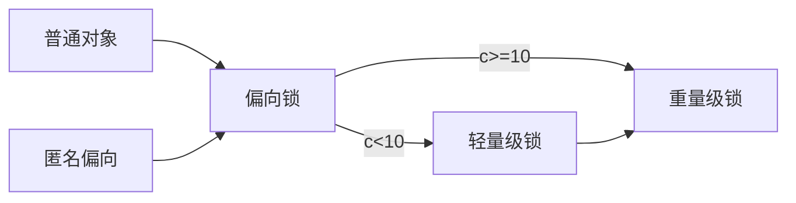

### 作用

保证可见性

保证原子性

保证有序性


jvm规范要求，被synchronized修饰的代码块，

### 锁分类


#### 根据修饰方式分类

##### 修饰代码块

**monitor**加锁，monitorenter锁入口monitorexit 锁出口，两个配合使用，java 生成的汇编指令文件中有两monitorexit ，前一个是正常锁出口后一个monitorexit   异常锁出口

java中每个对象都有一个monitor对象，对象锁通过monitor对象实现加锁 monitor，一个类存在多个对象，每个对象的锁互不干扰。

**monitorenter 锁入口**

**monitorexit   正常锁出口**

**monitorexit   异常锁出口**


##### 修饰方法

ACC_SYNCHRONIZED


synchronized修饰方法时，ACC_SYNCHRONIZED作为锁标记


#### 根据获取的锁分类

##### 获取对象锁

1. synchronized(Object|this) {}
2. 修饰非静态方法 public synchronized void methodname(){}


##### 获取类锁

1. synchronized(Class) {}

   对当前Class对象所对应的类的所有对象加锁

2. 修饰静态方法 public synchronized static void methodname(){}


#### 字节码层级


#### JVM层级（hotspot）

InterpreterRuntime::monitorenter

java的native源码，可以从jni.cpp或jvm.cpp


```c++
// Synchronization 锁
// 包含锁的升级过程
// The interpreter's synchronization code is factored out so that it can
// be shared by method invocation and synchronized blocks.
//%note synchronization_3

//进入锁
//%note monitor_1
IRT_ENTRY_NO_ASYNC(void, InterpreterRuntime::monitorenter(JavaThread* thread, BasicObjectLock* elem))
#ifdef ASSERT
  thread->last_frame().interpreter_frame_verify_monitor(elem);
#endif
  if (PrintBiasedLockingStatistics) {
    Atomic::inc(BiasedLocking::slow_path_entry_count_addr());
  }
  Handle h_obj(thread, elem->obj());
  assert(Universe::heap()->is_in_reserved_or_null(h_obj()),
         "must be NULL or an object");
  //开启偏向锁
  if (UseBiasedLocking) {
    // Retry fast entry if bias is revoked to avoid unnecessary inflation
    ObjectSynchronizer::fast_enter(h_obj, elem->lock(), true, CHECK);
  } else {
    ObjectSynchronizer::slow_enter(h_obj, elem->lock(), CHECK);
  }
  assert(Universe::heap()->is_in_reserved_or_null(elem->obj()),
         "must be NULL or an object");
#ifdef ASSERT
  thread->last_frame().interpreter_frame_verify_monitor(elem);
#endif
IRT_END

//退出锁
//%note monitor_1
IRT_ENTRY_NO_ASYNC(void, InterpreterRuntime::monitorexit(JavaThread* thread, BasicObjectLock* elem))
#ifdef ASSERT
  thread->last_frame().interpreter_frame_verify_monitor(elem);
#endif
  Handle h_obj(thread, elem->obj());
  assert(Universe::heap()->is_in_reserved_or_null(h_obj()),
         "must be NULL or an object");
  if (elem == NULL || h_obj()->is_unlocked()) {
    THROW(vmSymbols::java_lang_IllegalMonitorStateException());
  }
  ObjectSynchronizer::slow_exit(h_obj(), elem->lock(), thread);
  // Free entry. This must be done here, since a pending exception might be installed on
  // exit. If it is not cleared, the exception handling code will try to unlock the monitor again.
  elem->set_obj(NULL);
#ifdef ASSERT
  thread->last_frame().interpreter_frame_verify_monitor(elem);
#endif
IRT_END
```

#### OS层

**操作系统指令/汇编指令**


##### monitor指令


##### CAS

CAS操作虚拟机生成一条**lock cmpxchg**的汇编指令，cmpxchg意为比较并交换是非原子操作为了保证原子性加上了lock指令，lock指令会锁住访问内存总线使得其他线程无法访问同一内存区域从而自旋判断，线程不会进入随眠或阻塞状态而是一直自旋。CAS的优点在于**所有操作都在用户态中完成**（线程不会随眠阻塞，操作系统不需要切换到内核态进行线程调度），缺点在于**自旋消耗CPU，如果竞争激烈自旋的线程过多CPU的压力会很大**。


### 对象组成

openjdk hotspot 官方文档http://openjdk.java.net/groups/hotspot/

hotspot源码下载 http://hg.openjdk.java.net/jdk8/

java对象保存在内存中，由三部分组成

- 对象头
- 实例数据
- 对象填充字节


markword 8个字节

klass pointer 指针

实例数据

补齐


#### 代码

```java
public class Test {
    byte i = 0;
    short s = 0;
    long j = 0;
    int k = 1;
    public static void main(String[] args) {
        ClassLayout layout = ClassLayout.parseInstance(new Test());
        System.out.println(layout.toPrintable());
    }
}
```


对象信息

12byte的对象头信息，

实例变量所分配的内存空间大小，

最后JVM补齐的5个字节，

为了确保对象分配的堆内存空间为8的整数倍，27byteJVM补齐5byte实际占用32byte

```java
Test object internals:
 OFFSET  SIZE    TYPE DESCRIPTION                               VALUE
      0     4         (object header)                           01 00 00 00 (00000001 00000000 00000000 00000000) (1)
      4     4         (object header)                           00 00 00 00 (00000000 00000000 00000000 00000000) (0)
      8     4         (object header)                           54 c7 00 20 (01010100 11000111 00000000 00100000) (536921940)
     12     4     int Test.k                                    1
     16     8    long Test.j                                    0
     24     2   short Test.s                                    0
     26     1    byte Test.i                                    0
     27     5         (loss due to the next object alignment)
Instance size: 32 bytes
Space losses: 0 bytes internal + 5 bytes external = 5 bytes total
```


object header 对象头

​	4     int Test.k  				实例数据

loss due to the next object alignmen 对象填充数据


### 对象头

#### 定义

openjdk对jvm规范对象头定义如下：


每个gc管理的堆对象开头的公共结构。(每个oop都指向一个对象标头。)包括堆对象的布局、类型、GC状态、同步状态和标识哈希码的基本信息。由两个词组成（mark word,klass pointer）。在数组中，它后面紧跟着一个长度字段。注意，Java对象和vm内部对象都有一个通用的对象头格式。

mark word

klass pointer

实例数据

补齐


#### **mark word**/klass pointer

**mark word**

保存包含有锁状态、GC信息（GC标志、age）、对象唯一标识

The first word of every object header. Usually a set of bitfields including synchronization state and identity hash code. May also be a pointer (with characteristic low bit encoding) to synchronization related information. During GC, may contain GC state bits.

**klass pointer**

每个对象标头的第二个单词。指向描述原始对象的布局和行为的另一个对象(元对象)。对于Java对象，“klass”包含一个c++风格的虚拟表（“vtable”）。


#### 锁的四种状态


##### 重量级锁与轻量级锁的区别


偏向锁和轻量级锁都是用户空间完成

重量级锁需要内核空间完成（有系统调用在用户态、内核太之间切换）


- 无锁状态

  

  

- **偏向锁**

  **用户空间完成**

  自旋获取锁（获取失败自旋）

  缺点是：自旋消耗CPU，如果多个线程长时间自旋，CPU升高性能降低

  优点：

  ​	1、偏向锁在用户态中实现，没有系统调用也就没有用户态、内核态之间的切换

  ​	2、虽然加了锁，但是绝大多数时间只有一个线程在使用，这时使用偏向锁，没有额外的锁的开销，性能更好

     但是若有其它线程申请锁，这时偏向锁就升级为轻量级锁。    

    

- **轻量级锁**

  **用户空间完成**

  发现偏向锁的线程ID不是自己，线程CAS尝试获取锁，获取失败一定次数后升级重量级锁

  

- **重量级锁**

  底层通过mutex lock（互斥锁）实现，等待锁的线程会被阻塞（阻塞队列中），由于Linux下Java线程与操作系统内核态线程一一映射，**所以涉及用户态和内核态之间的切换**，**内核态中线程的挂起和唤醒操作**(线程之间的切换在内核中完成)。所以称之为重量级锁

  **用户态到内核态的切换是一个十分重量级的操作所以称为重量级锁**
  
  




###### **Mutex Lock**（互斥锁）


##### 用户态和内核态的转换

用户态切换到内核态的三种方式：系统调用、异常、外围社保的中断

###### 系统调用

从下到上看一个完整的计算机系统：物理硬件 -> OS内核 -> OS服务 ->应用程序

OS内核向下管理硬件，向上为操作系统服务和应用程序提供接口。


系统调用是应用程序主动进入内核的方式


##### 锁的升级过程


##### **轻量级锁的加锁过程**

1、线程运行到程序的同步代码块时，若mark word为无锁状态，则虚拟机在当前线程的栈贞中建立Lock Record空间

2、复制mark word到Lock Record中

3、若复制成功，虚拟机使用CAS操作将对象头的mark word修改为Lock Record的指针【stack pointer】，Lock Record中的owner指向mark word

4、修改成功，修改Lock Record中的mark word 的锁状态为轻量级锁 00

5、若修改失败，虚拟机检查mark word是否指向当前线程的栈贞，如果是则当前线程拥有锁执行同步代码，如果不是，说明存在多个线程竞争，

修改mark word中的锁标识为重量级锁（执行升级重量级锁的逻辑）


### 死锁

线程1获取对象A的锁，进入锁住的代码，发现需要对象B的锁，尝试获取对象B的锁

synchronized(ObjectA) {

​	synchronized(ObjectB)

}


线程2获取了对象B的锁，进入代码，发现需要对象A的锁，尝试获取对象A的锁

synchronized(ObjectB) {

​		synchronized(ObjectA)

}


线程1占有对象A的锁尝试获取对象B的锁发现被线程2占有于是等待，  同时线程2占有对象B的锁尝试获取对象A的锁同样发现被线程1占有于是等待，**两个线程同时等待获取对方释放所占有的锁**，他们都不会继续向下执行，也释放不了锁，于是永远停在了这里等待，这就是死锁


#### 代码

```java
package com.wdq.juc;

import java.util.concurrent.TimeUnit;

public class DeadLockDemo {
    private String locka = new String();
    private String lockb = new String();

    public static void main(String[] args) {
        DeadLockDemo lockDemo = new DeadLockDemo();
        new Thread(()->{lockDemo.testa();
        },"thread aaaa").start();
        new Thread(()->{
            lockDemo.testb();
        },"thread bbbb").start();
    }
    public void testa() {
        synchronized (locka) {
            System.out.println(Thread.currentThread().getName() +"获取locka锁" );
            try {
                TimeUnit.SECONDS.sleep(1);
            } catch (InterruptedException e) {
                e.printStackTrace();
            }
            synchronized (lockb) {
                System.out.println("执行业务aaaa");
            }
        }
    }
    public void testb() {
        synchronized (lockb) {
            System.out.println(Thread.currentThread().getName() +"获取lockb锁" );
            try {
                TimeUnit.SECONDS.sleep(1);
            } catch (InterruptedException e) {
                e.printStackTrace();
            }
            synchronized (locka) {
                System.out.println("执行业务bbbb");
            }
        }
    }
}

```


#### 排查

如何查看java程序是否发生死锁

1. jps -l

   查看java进程号

2. jstack pid

   查看java进程堆栈信息

   

**java进程堆栈信息**

```java
Java stack information for the threads listed above:
===================================================

"thread bbbb":
        at com.wdq.juc.DeadLockDemo.testb(DeadLockDemo.java:39)
        - waiting to lock <0x00000000d5d03fd0> (a java.lang.String)
        - locked <0x00000000d5d03fe8> (a java.lang.String)
        at com.wdq.juc.DeadLockDemo.lambda$main$1(DeadLockDemo.java:14)
        at com.wdq.juc.DeadLockDemo$$Lambda$2/379110473.run(Unknown Source)
        at java.lang.Thread.run(Thread.java:745)
"thread aaaa":
        at com.wdq.juc.DeadLockDemo.testa(DeadLockDemo.java:26)
        - waiting to lock <0x00000000d5d03fe8> (a java.lang.String)
        - locked <0x00000000d5d03fd0> (a java.lang.String)
        at com.wdq.juc.DeadLockDemo.lambda$main$0(DeadLockDemo.java:11)
        at com.wdq.juc.DeadLockDemo$$Lambda$1/1555093762.run(Unknown Source)
        at java.lang.Thread.run(Thread.java:745)

Found 1 deadlock.
```


最后一行明确说明是死锁deadlock，而且两个线程在等待对方持有的锁

"thread bbbb": waiting to lock <0x00000000d5d03fd0>  locked <0x00000000d5d03fe8>

"thread aaaa":waiting to lock <0x00000000d5d03fe8>    locked <0x00000000d5d03fd0>

thread bbbb  持有<0x00000000d5d03fe8> 等待锁<0x00000000d5d03fd0>，而此时thread aaaa 持有

<0x00000000d5d03fd0> 等待<0x00000000d5d03fe8>


The Java@ V irtual
Machine Specification
Java SE 13 Edition