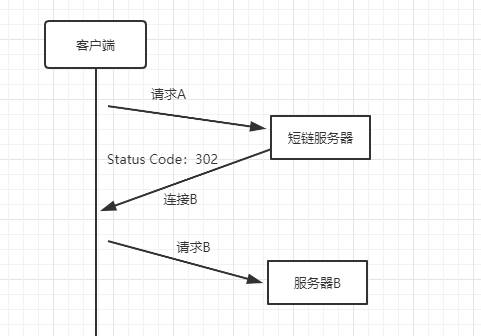

# 高性能短链系统

## 短链的好处

### 够短

短链长度够短，在对字数长度有要求的平台上发文，可编辑字数变多

1、微博发文

2、短信

短信发文长度有限制，如果链接太长影响短信可编辑内容，更甚要拆分成几条短信

### 二维码更易识别

如果连接过长生成的二维码密集难识别，短连接二维码密集度低更易识别

### 没有无法自动识别为超链接问题

链接太长在有些平台上无法自动识别为超链接，如图示，在钉钉上，就无法识别如下长链接，只能识别部分，用短地址无此问题

## 短连接跳转的基本原理

### 请求流程

浏览器抓包看到，发送请求后，返回了状态吗302（重定向）与location为长链的响应，然后浏览器会再次请求长链以得到最终的响应。

### 状态码301 和 302

http状态码301 和 302 都是重定向，这两种状态怎么选择

- 301，永久重定向

  第一次请求拿到长链接后，缓存到浏览器，下次再请求短连接的话不会再请求服务器了，而是重浏览器的缓存中拿，这样在server端就无法获取短连接的点击数了，**如果这个链接刚好是某个活动的链接，也就无法分析此活动的效果。所以我们一般不采用 301**。

- 302，临时重定向

  也就是说每次去请求短链都会去请求短网址服务器（除非响应中用 Cache-Control 或 Expired 暗示浏览器缓存）,这样就便于 server 统计点击数，所以虽然用 302 会给 server 增加一点压力，但在数据异常重要的今天，这点代码是值得的，所以推荐使用 302！

## 短链生成的几种方法

### 哈希算法

### 自增序列算法