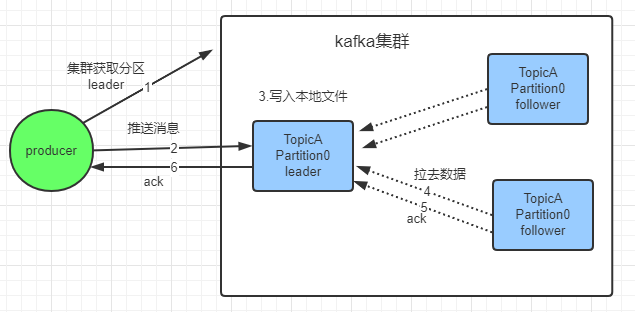

https://mp.weixin.qq.com/s?__biz=MzI3NzE0NjcwMg==&mid=2650149354&idx=3&sn=17a7e93766f656e0bcefd24df2f5448a&chksm=f3680ccbc41f85dd74877978cea89ef0a495c7ef9847834eabe673587cb1fb9855a95d95ba58&scene=27#wechat_redirect

## 消息传递语义

kafka有三次消息传递过程

1、生产者投递消息到broker

2、broker消息同步 和 持久化

3、consumer消费消息

这三步每一步都可能产生消息丢失

## 消息丢失

kafka有三次消息传递过程，每个过程都有可能丢失消息

### 生产者丢消息

#### 1、生产者投递消息过程

1、生产者与broker直接交互，从集群获取topic对应分区leader的元数据

2、生产者获取到元数据后，推送消息到broker

3、broker对应topic分区的leader收到消息后 写入持久化文件

4、follower拉去leader消息与leader数据保持一致

5、follower消息同步完成后 回复ACK消息给leader

6、leader 和 follower消息同步完成，leader会回复ACK消息给生产者

kafka 通过配置request.required.acks属性来确认消息的生产：

0：表示不进行消息是否成功的确认

1：表示leader接收成功时确认

-1：表示leader 和 follower都接收成功时确认（leader、follower都成功接收消息才发送下一条消息）

#### 2、可能出现的消息丢失情况

1、ack = 0，不进行消息确认，网路抖动、磁盘满了等导致消息丢失，生产者不进行校验和处理消息就丢失了

2、ack = 1，leader接收成功时确认，恰巧leader挂了，重选了一个没有ACK的follower，那消息也丢失了

3、ack = -1，保证leader 和 follower都不丢，**存在消息重复问题**

follower同步了leader的数据，在返回ack之前leader宕机了，此时producer会重发数据，导致数据重复

### broker丢消息

broker接收到消息后将数据持久化到磁盘，这个过程分为两步1.将数据写入系统cache 2.操作系统将cashe中数据持久化到磁盘。broker将数据写入cache还未来得及写入磁盘机器发生宕机、掉电

### 消费者丢消息

消费者消费的进度通过offset保存在kafka集群的**__consumer_offsets这个topic**中。

消费消息的时候主要分为两个阶段：

1、标识消息已被消费，commit offset坐标；

2、处理消息。

#### 可能出现丢消息的情况

##### 1、先commit offset，再处理消息

处理消息时发生异常，此时offset已经提交，这条消息对于消费者来说就是丢失了，再也消费不到了

**解决方案**：

1、再次投递消息，处理消息时发生异常重发一次消息给kafka

##### 2、先处理消息，再提交commit offset

消息已消费，在commit之前发生异常，下次还会消费到该消息，出现消息重复问题，可以通过业务保证幂等性来解决 

## 消息重复