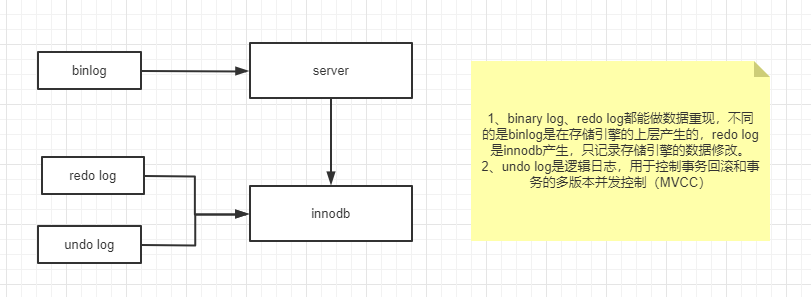
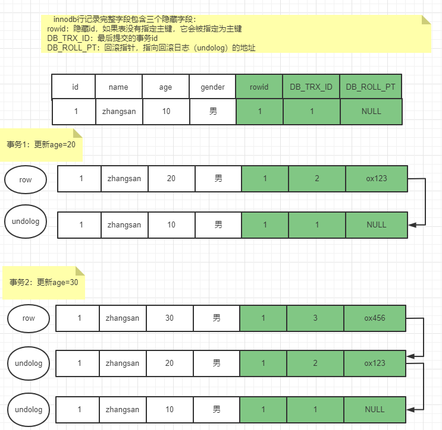
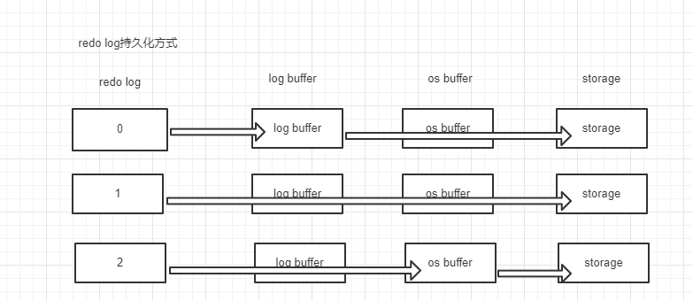

### 日志

**分类**

binlog

undo log

redo log

relay log【中继日志，主从同步是从机将读取的binlog写到relay log等待从机sql thread读取将数据写到磁盘】

error log

慢查询日志

#### undo log

逻辑日志，事务一致性原理，提供数据回滚 和 MVCC多版本控制

对数据行的插入、修改、删除都会产生一条undolog回滚日志，innodb的数据行包含三个隐藏字段rowid、DB_TRX_ID、DB_ROLL_PT，

rowid ： 隐藏主键，如果数据表没有指定主键字段，innodb使用rowid作为表的主键

DB_TRX_ID ：最后操作行记录的事务id

DB_ROLL_PT ：指向回滚日志的指针

**undolog版本链**

对一行数据进行修改（update、delete），产生一条该行数据的回滚日志undolog，该行记录的隐藏字段DB_ROLL_PT指向这条undolog的地址，下一次修改时，同样产生一条undolog（一个事务中可能多次修改），并且与前一个undolog通过回滚指针相连形成一条链，最新的undolog总是放在链首。

##### 特别说明

undolog版本链

#### binary log

二进制日志，**主从同步是同步的binlog**

| 模式                              | 记录内容                                 | 优点                               | 缺点                                     | 使用场景                                 |
| --------------------------------- | ---------------------------------------- | ---------------------------------- | ---------------------------------------- | ---------------------------------------- |
| **Statement-based Logging (SBR)** | 记录 SQL 语句                            | `binlog` 文件小，易于分析          | 可能存在非确定性问题，主从同步可能不一致 | SQL 语句确定性高时，适用于大多数场景     |
| **Row-based Logging (RBR)**       | 记录数据的行级变化                       | 精确记录数据变更，避免非确定性问题 | `binlog` 文件大，存储和网络开销高        | 数据一致性要求高，适用于复杂操作的场景   |
| **Mixed-based Logging (MBR)**     | 根据 SQL 语句类型自动选择使用 SBR 或 RBR | 结合了 SBR 和 RBR 的优点，存储小   | 更复杂的日志记录方式，日志解析困难       | 适用于大多数生产环境，能平衡存储与一致性 |

##### 选择合适的 `binlog` 模式

- **性能优先**：如果系统中操作较简单且对数据一致性的要求不高，可以选择 **SBR** 模式。
- **一致性优先**：如果对数据一致性要求较高，特别是涉及到复杂 SQL 或不确定性函数时，建议使用 **RBR** 模式。
- **平衡性能与一致性**：如果希望在性能和数据一致性之间找到平衡，建议使用 **MBR** 模式，它会根据具体情况自动选择最佳记录方式。

通常，生产环境中 MySQL 默认使用 **Mixed-Based Logging (MBR)** 模式，这能较好地平衡性能和一致性。

#### redo log

物理日志，

持久化方式

mysql更新数据先将数据加载到内存进行修改后写到磁盘【随机IO】，由于磁盘读写速度相对较慢发生断电和故障时数据发生丢失。为了尽量避免发生数据丢失，mysql在持久化过程中加入了redolog，将内存中操作的数据先顺序写到redolog，然后顺序读redolog日志持久化到磁盘。

### 当前读、快照读

**当前读和快照读共同实现了mysql的四种隔离级别，其中快照读的实现依赖 undolog版本链条 和 readview可读试图，当前读依赖于间隙锁实现。**

准确的说是undolog版本链 + readview + 锁实现了mysql的四种隔离级别，具体如何实现下文事务隔离级别段落详解。

##### 当前读

**总是读取最新的数据**

当前读：读取最新的数据，同时加锁（间隙锁）

innodb存储引擎，执行以下sql发生当前读

select... for update;

select ... lock in share mode;

insert、update、delete

##### 快照读

**读取数据的历史版本，可能不是最新数据**

innodb存储引擎，执行select....时发生快照读

实现：事务中执行select....时对当前事务生成readview（不同的隔离级别生成readview的规则不同，RC每次select都生成一个readview,RR只在第一次select...生成唯一readview），通过readview可以定位到当前事务可以读取哪些undolog从而拿到数据（前面分析过，undolog是数据的历史版本）。

##### RR隔离级别不能从根本上解决幻读

mysql 官网对innodb引擎下幻读的定义：一个事务中，同一个查询在不同的时间产生不同的行集。

**幻读**：一个事务中，同一个查询在不同的时间产生不同的行集。

结论：RR隔离级别，**当前读导致幻读**

### mvcc

#### 什么是mvcc

multi version concurency control 多版本并发控制

#### mvcc解决什么问题

1、提高并发读写性能，不用加锁就能让多个事务并发读写。 

2、解决脏读、幻读、不可重复读等事务隔离问题，但是不能解决更新丢失问题。

#### 事务版本链

undolog版本链

#### readview

主要是用来判断版本链中哪个版本是当前事务可见的。

mysql执行查询sql时（快照读）会生成一致性视图read-view，主要包含4个重要内容：

1、m_ids：表示生成识图时所有未提交事务的事务id列表

2、min_trx_id ：最小事务id，当前未提交事务中的最小事务id

3、max_trx_id ：最大事务id（包含已提交、未提交、未开始的事务）

4、creator_trx_id ： 生成该readView的事务的事务id

对于Read Uncommited隔离级别来说直接读取最新的数据，Serializable隔离级别的事务，使用加锁的方式来访问

**Read Commited**事务隔离级别的实现方式

每次快照读前都生成一个ReadView

**Repeatable read**实现方式

第一次快照读时生成一个ReadView

##### 可见规则【可见性算法】

有了这个ReadView，这样在访问某条记录时，只需要按照下边的步骤判断记录的某个版本是否可见：

1. 如果被访问版本的trx_id属性值与ReadView中的creator_trx_id值相同，意味着当前事务在访问它自己修改过的记录，所以该版本可以被当前事务访问。
2. 如果被访问版本的trx_id属性值小于ReadView中的min_trx_id值，表明生成该版本的事务在当前事务生成ReadView前已经提交，所以该版本可以被当前事务访问。
3. 如果被访问版本的trx_id属性值大于ReadView中的max_trx_id值，表明生成该版本的事务在当前事务生成ReadView后才开启，所以该版本不可以被当前事务访问。如果被访问版本的trx_id属性值在ReadView的min_trx_id和max_trx_id之间，那就需要判断一下
4. trx_id属性值是不是在m_ids列表中，如果在，说明创建ReadView时生成该版本的事务还是活跃的，该版本不可以被访问；如果不在，说明创建ReadView时生成该版本的事务已经被提交，该版本可以被访问。

### 锁

共享

排它

组件

间隙锁

临键

### 事务隔离级别

innodb支持四种事务隔离级别，	read uncommit (RU)读未提交，read commited(RC)读已提交，repeatable read(RR)可重复读，serializable串行，

针对不同隔离级别，多个事务并发运行时存在的问题如下：

 

| 隔离级别        | 脏读   | 不可重复读 | 幻读   |
| --------------- | ------ | ---------- | ------ |
| read uncommited | 存在   | 存在       | 存在   |
| read commited   | 不存在 | 存在       | 存在   |
| repeatable read | 不存在 | 不存在     | 不存在 |
| serializable    | 不存在 | 不存在     | 不存在 |

这是众所周知的结论，更应该关注innodb究竟是如何实现的

##### 隔离级别的实现

**脏读、重复读、幻读都是事务并发所造成的问题**

脏读：读取到其它事务未提交的数据

重复读：事务中多次查询得到的数据结果不一致

幻读：事务中多次同一查询得到的数据总量不一致

**如果同一个事务中全是快照读是不会产生幻读的，只有同时使用当前读、快照读才会产生幻读问题。**

##### RU

事务中每次读undolog版本链链首的日志，可能是其它事务未提交前的undolog产生脏读，

##### RC

事务中每次select...发生当前读产生readview可读试图，如果其它事务对数据进行修改并且提交，当前事务发生快照读生成新的readview，已提交的事务id必然<= readview的最大事务id，通过readview可以访问该版本的undolog，也就是能读取修改后的数据，所以前后两次读取的数据不同，就出现不可重复读问题。

##### RR

**innodb 的RR隔离级别完全解决幻读，MVCC解决快照读的幻读，next-lock解决当前读的幻读问题**

###### 快照读幻读

事务中第一次select....发生快照读生成readview，后续的查询一直使用它，所以不论其它事务如何改变数据当前事务查询到的数据是都是一致的，因为通过		readview能读取到的undolog始终是那些，这就解决了脏读、不可重复读、幻读问题。

###### 当前读幻读

当前读时，对相关行加锁，其它事务无法对相关行进行修改、插入，只能等当前事务commit。就是说当前读锁住了相关行，只能自己访问，不论查多少次返回的行记录都是一致的，不会出现幻读。

特殊说明：

如果在事务中发生当前读（加锁读、修改），就会读取到最新的行数据，可能造成数据总量前后不同，但这种情况不属于幻读，**前后查询不一致**。

##### serializable

串行化，锁表，事务不能并发执行。

先后开启多个事务，在其他所有事务提交前不能进行插入、修改操作。

### 事务的特点（ACID）

#### **原子性** 

要么全部成功，要么全部失败

##### 实现原理

undo log回滚日志

#### 一致性

**对数据可见性的一种约束**

事务对数据进行修改时，其它事务只对开始 和最终状态可见， 对该事务的中间状态不可见

#### 隔离性

锁+mvcc实现

并发事务不相互影响

#### 持久性

redo log

事务一旦提交，其对数据库的更新就是持久的，任何事务或系统故障数据都不能丢失，涉及2阶段提交

### 二阶段提交

当redolog和binlog同时存在时，

1、将redolog写到磁盘并给相应的redolog加上prepare状态

2、写binlog

3、binlog写成功后，将redolog的prepare状态改为commit

mysql innodb引擎进行数据恢复时，读取redolog，如果发现状态为prepare就去查找binlog相应数据，如果

binlog存在相应数据将redolog改为commit状态并恢复数据，如果binlog中没有匹配的日志则丢弃这条redolog。

### 事务优化

优化原则：在保证业务逻辑的前提下，尽可能缩短事务长度

### 面试问题

1、当redolog和binlog同时存在时，应该先写谁后写谁？

innodb数据恢复使用redolog，mysql多台服务使用binlog进行数据同步，

同时存在redolog和binlog， 不论先写哪个日志当出现断电或故障时都可能导致多台mysql数据不一致。

有master/slave两个mysql节点当我们对master一个字段进行+1操作，先写redolog再写binlog，写完redolog还未写binlog发生断电，恢复供电进行数据恢复读取redolog磁盘数据+1，salve同步master的binlog没有对该条数据+1，导致master/slave数据不一致

反过如果先写binlog后写redolog，导致slave同不得数据+1,而master的数据没有+1

2、为什么redolog不与binlog合并成一个日志

binlog是mysql server的日志文件，innodb是mysql引入的数据库引擎redolog是innodb自带的。