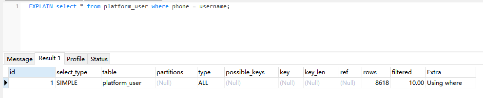

## 索引何时会失效 

### 1、列与列对比

两列都建了索引，进行对比，不会走索引

### 2、字段存在 null

索引字段存在null，is null 和 is not null查询条件索引是否失效？

**索引是否失效，取决于查询成本**，索引列 null值多时is not null走索引 is null全表扫描，索引列null值少时则相反is not null全表扫描  is null走索引。

如果查询字段只包含索引列不需要回表，那索引一定不会失效。

innodb的二级索引（聚簇索引）的值可以为NULL，将其保存在B+树的左下角（SQL中的NULL被认为是最小值，这些值都是相同的）。

索引列的NULL值多时，is not null查询出的不为NULL值的数据少需要回表的数据少，这种情况走索引；is null查询为NULL值的数据多需要回表的数据多，mysql查询优化器会认为这种情况查询索引还不如全表扫描。

反过来，NULL值少时，is not null 查询出的不为NULL值的数据多 需要回表的数据多，这种情况mysql查询优化器认为全表扫描速度更快（不需要回表）也就是索引会失效。

但是同样对该索引列使用等值查找（=），不论如何索引都不会失效，这是为什么呢？

mysql查询优化器对is null、is not null查询条件认为是范围查找，预期是查询出多条数据（并不绝对，看数据情况），如果当前查询条件命中的索引多余数据的一半mysql查询优化器认为全表扫描是更好的方案，此时索引失效而是全表扫描， 因为命中二级索引后需要回表，而全表扫描不需要回表。

如果命中索引少于数据的一半，mysql查询优化器认为索引查询数据更好。

a. 存储引擎，存储引擎是innodb、myisam、memerory时字段为null值可以创建索引，其它存储引擎不能创建索引

b. 索引是否失效，取决于查询成本

**NULL少**

sql 1 ：索引失效

is null:  命中索引

索引列 null值多时is not null走索引 is null全表扫描，索引列null值少时则相反is not null全表扫描  is null走索引。

**NULL多**

is not null : 命中索引

is null : 索引失效

查询索引列：命中索引

​		select keyword from test 查询的字段为索引列，直接读取索引值即可返回，select * from test 查询命中索引后还需要定位到数据列的位置再返回所有字段，**当数据量少时**，可能会更慢，所以mysql的查询优化器选择了全表扫描。

mysql查询优化规则，非等值条件（=）查询时索引是否失效

#### 总结

**索引是否失效，取决于查询成本**。

通过二级索引查询数据返回，分为两个步骤 1、索引查询 2、数据回表，命中二级索引后通过索引保存的数据保存的磁盘地址找到数据返回。

**如果查询条件命中了一定数量（超过一半）索引，那么需要回表的数据也大，mysql查询优化器认为对索引查询 和 对大量索引进行回表的性能不如直接全表扫描，这种情况下索引失效进行全表扫描。**

#### 发散

**按照mysql的优化规则，所有的非等值条件查询都会遵循此规则。等值条件（=），非等值条件 <， >， !=，is null, is not null, in,  not in,  exsits**

**结论验证**

age > 16的数据少于 age <=16的数据，索引未失效

age > 12的数据少于 age <=12的数据，索引失效

age != 12的数据 多余age = 12的数据，索引失效

### 3、like

索引的匹配规则左匹配（从左向右匹配）

#### 结论

**通常情况下 后置%可以用到索引，前置和两侧%索引失效**

**如果只查询索引字段那无论如何都会走索引**

#### 为什么

索引的匹配规则左匹配（从左向右匹配），左模糊查询时mysql认为能将查询条件与索引从左向右匹配，右模糊和全模糊查询时有悖于索引匹配规则所以索引失效。但是如果sql**只返回索引列那么无论如何都会走索引，因为只返回索引列不需要回表，无论如何查询索引效率远高于全表扫描**。

%前置后模糊，索引失效（全表扫描）

%后置，前模糊，走索引

%两侧，全模糊，索引失效（全表扫描）

### 4、NOT条件

in、not in

#### **结论**

in 条件查询出的结果超过一定数量时，索引失效、全表扫描

in 中的条件只有1个时，视为等值查询（=）都会走索引

not in  索引失效，全表扫描

exists	 索引失效，全表扫描

### 5、数据类型转换

当查询条件的数据类型发生隐式转换，索引失效。有一种转换另外，字符串转number时还是会走索引。

int 转 varchar 索引失效

varchar 转 number，走索引

### 6、谓词计算 和 包括函数

对索引列进行计算 和 函数计算后，索引失效，因为索引列的值与 索引中保存的值不一致，无法进行匹配。

但是如果在条件上进行计算 和 函数计算，依然可以走索引。

谓词计算，索引失效

函数计算，索引失效

