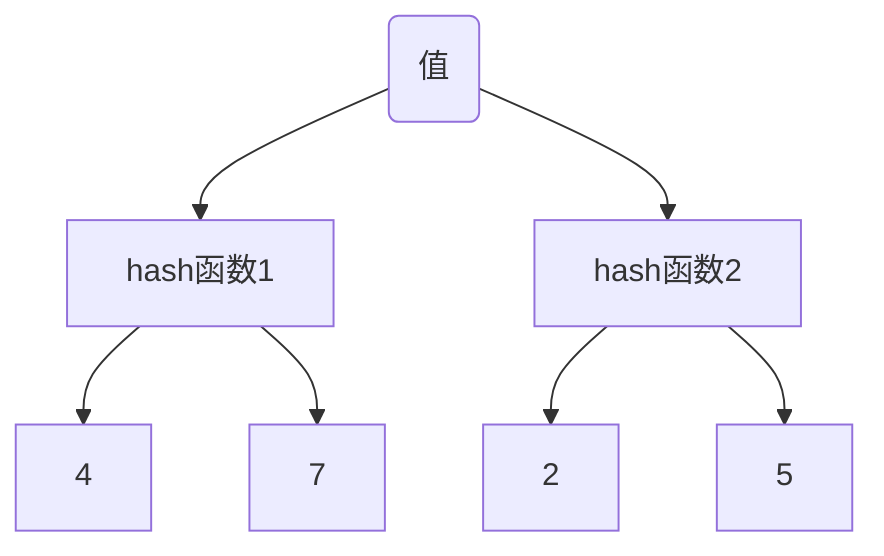

## 缓存穿透

查询缓存中没有的数据，而直接查询了数据库（mysql）

示例

1、假如查询一个不存在的id -1，缓存中没有查询数据也没有，只要请求不存在的id就会查询数据库。黑客就可以使用这种方式大量的请求，对数据库造成大量并发访问从而影响其它数据库访问很慢，系统的响应速度变慢。

解决办法：缓存查询到数据库中没有，同样将null结果写入缓存，这样后续的请求过来时也能查询到缓存（结果为null）而不会穿透到数据库

思考：若传入的id是变化的（比如uuid）该如何解决

2、若传入的id是变化的（比如uuid），按照第一种解决方式处理每次请求都会落到数据库查询然后在 redis中增加一个key-value，导致redis内存很快就不够用，redis使用内存淘汰策略（LRU）淘汰掉其它的key-value，将有更多的数据查询落在数据库上，造成数据库压力

解决方式：**布隆过滤器**

sql查询条件缓存在布隆过滤器中，如果请求条件不在布隆过滤器中则直接丢弃，如果在则查询缓存

**牺牲一定准确性换取速度和安全性**，对于缓存穿透的解决方案，布隆过滤器完全可以胜任，极少部分不存在的key通过了布隆过滤器

### 布隆过滤器

byte数组，初始值0，

hash算法  、长度

使用hash算法将key散列到数组各个下标，如果下标值为0 修改为1，为1不变。当判断某个过滤器中是否存在某个值，将hash后的结果去数组中找，如果所有下标对应的值都为1，则这个值存在（不完全），如果某一个值为0 则一定不存在。**牺牲一定准确性换取速度和安全性**

优点：数据量小占用空间少，一。

​			速度快

缺点：

​	**1、由于通过hash算法散列所以存在hash碰撞，造成判断不准确**

解决办法		

**多个散列函数**，一个hash函数计算后散列到两个数组位置，再经过另一个hash函数计算得到两个不同的值，这样就有4个下标值，发生重复的概率就更小（假如过滤器长度100，理论上这样重复概率就是 1/100^4，但当保存的值过多将所有位置都为1，这时候就得扩容了，所以hash函数的个数和数组长度需要一个评估和调优）

​		**增加过滤器数组容量**

​	**2、不能删除值**

​	加计数器

#### 使用场景

​	缓存穿透

​	黑名单、白名单

## 缓存雪崩

同一时间点多个缓存过期失效或者redis服务器发生故障，造成这个时间点大量请求打到数据库

解决办法：

多个缓存同时失效：随机过期时间，缓存不在同一时间过期

redis服务器发生故障：如果缓存数据量不大，主备【全量数据】集群

​										缓存数据量大，分片，其中一台不可用只有部分数据落到数据库，可用服务器继续缓存

## 缓存击穿

单个缓存穿透，

普通场景下不需要处理这种情况，除非并发量特别大，

## Redis的Hash一致性算法

#### 集群扩容

#### 数据倾斜

